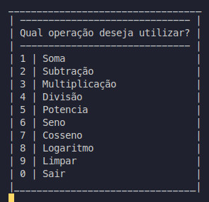

# Renatinho Calculator

Calculadora que realiza cálculos simples, abaixo segue o menu da calculadora onde poderá selecionar a opção desejada.



1. Realiza a Soma de dois operandos;
2. Realiza a subtração de um valor pelo outro.
3. Realiza a multiplicação de dois operandos;
4. Realiza a divisão entre dois operandos;
5. Realiza o calculo de exponenciação entre dois operandos;
6. Descobre o valor do Seno de um operando (ângulo);
7. Descobre o valor do Cosseno de um operando (ângulo);
8. Realiza uma operação de Logaritmo utilizando a base e logaritmando.
9. Limpa o valor anterior.

*Após realizar um cálculo, você poderá prosseguir para uma nova operação mantendo o resultado da operação anterior e utilizando-o como novo operando.

*Após cada operação, o resultado será automaticamente copiado para o clipboard.

*Para inicializar o aplicativo deve-se dar os seguintes comandos:

```bash
  javac App.java
  java App
```
